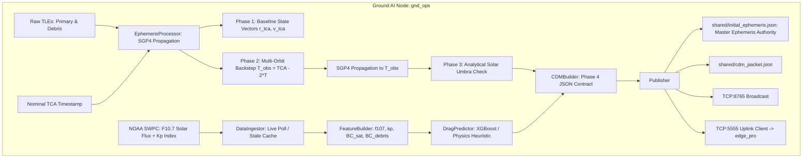
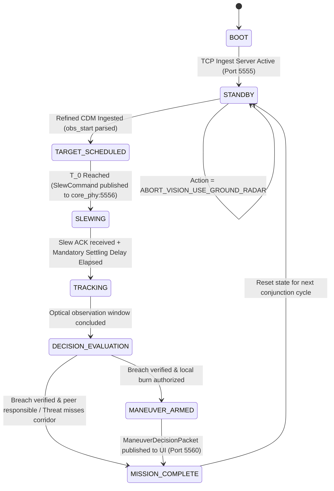

# Project Kessler: Autonomous Operations Intelligence Desk (AOID)
## Comprehensive Technical Walkthrough & Architecture Master Document

---

## 1. Executive Summary & Core Mission Concept

### 1.1 The Operational Problem
Traditional ground-based Space Situational Awareness (SSA) relies on ground radars that observe Low Earth Orbit (LEO) debris with significant tracking uncertainty. These uncertainties propagate over time into massive **"error ellipsoids"** (spanning several kilometers). Consequently, spacecraft operators face thousands of Conjunction Data Messages (CDMs) annually where the true miss distance is unknown. 

Because false alarms cannot be distinguished from catastrophic collisions:
- Spacecraft execute premature, high-$\Delta v$ avoidance burns for false positives.
- Critical onboard chemical/electric propellant is depleted prematurely, shortening satellite operational lifespans by years.
- Conversely, late-stage detection (e.g. at $T - 30\text{ minutes}$) is an orbital death sentence: at 30 minutes prior to encounter, an object in a standard 90-minute LEO orbit is physically on the other side of the planet, requiring massive impulsive $\Delta v$ that exceeds standard reaction thruster authority.

### 1.2 The AOID Solution
Project Kessler solves this dilemma through a **hybrid ground-edge intelligence pipeline**:
1. **Ground AI Preprocessing (Single Source of Truth)**: Ground AI fetches live TLEs and NOAA space weather data, runs SGP4 orbital propagation, generates the master Cartesian ephemeris vectors ($\vec{r}, \vec{v}$) for the physics simulation, and schedules an observation window **multiple orbits in advance** ($T_{\text{obs}} = \text{TCA} - 2 \cdot T_{\text{orbit}}$) while analytically verifying direct sunlight (clear of Earth umbra shadow).
2. **Predictive Spacecraft Slew & Jitter Damping**: The spacecraft ADCS slews the vehicle's body to point an existing onboard Star Tracker along the incoming threat vector. A mandatory **settling delay** (default $6.0\text{s}$, scaled in simulation) allows reaction wheel torque transients and flexible body vibrations to damp out completely before sensor arming.
3. **Parallel Edge Vision Processing**: An independent edge compute process intercepts the Star Tracker video stream, performs consecutive and reference frame differencing to erase the static Tycho catalog starfield, and extracts the transient debris streak centroid $[X, Y]$ and 2D velocity vector $[v_x, v_y]$.
4. **Safety Volume Intersection**: The edge node projects a $1\text{ km} \times 1\text{ km} \times 0.5\text{ km}$ 3D danger corridor into 2D camera coordinates and tests for trajectory intersection using **Liang-Barsky directed ray clipping** ($t \ge 0$), eliminating false positive collision alerts for divergent or receding debris.
5. **Active-Active Negotiation & Minimal $\Delta v$**: If a breach is verified, a multi-variable decision engine evaluates fuel reserves, remaining lifetime, mission priority, and downtime to assign maneuver responsibility. It computes a minimal out-of-plane burn ($\Delta v \approx 0.35\text{ m/s}$) executed at an optimal orbital node.
6. **Decoupled 3D vs. 2D Visual Realities**: Unity Vizard represents the true 3D "Physical Reality" (spacecraft dynamics, ephemeris, reaction wheel spins), while the 2D "Software Reality" HUD overlays (danger corridor bounding box, debris centroid, velocity vector, telemetry banner) are exported to `shared/processed_frames/latest_corridor_hud.jpg` for display on the operator's Streamlit Dashboard.

---

## 2. End-to-End System Architecture & Topology

```mermaid
sequenceDiagram
    autonumber
    participant GND as Device 1: Ground AI Node (Role 3)
    participant EDGE as Device 2: Edge Payload (Role 2)
    participant FSW as Device 3: Physics & ADCS (Role 1)
    participant UI as Device 4: AOID Dashboard (Role 4)

    Note over GND: Ingests TLEs + NOAA Space Weather<br/>Computes 2-Orbit Backstep & Umbra Check
    GND->>FSW: shared/initial_ephemeris.json (Master Ephemeris Authority)
    GND->>EDGE: TCP 5555: REFINED_CDM JSON
    activate EDGE
    EDGE-->>GND: TCP ACK: {"status": "ACK", "message": "REFINED_CDM_RECEIVED"}
    deactivate GND

    Note over EDGE: Scheduler parses obs_window<br/>FSM transitions: STANDBY -> TARGET_SCHEDULED
    EDGE->>FSW: TCP 5556: SlewCommand (SLEW_TO_TARGET)
    activate FSW
    FSW-->>EDGE: TCP ACK: {"status": "ACK", "message": "SLEW_COMMAND_ACCEPTED"}
    
    Note over FSW: mrpFeedback closed-loop slew<br/>Reaction wheel cluster aligns boresight
    FSW->>EDGE: TCP 5000: Binary Stream (msg_type=0: LOCKED)
    Note over EDGE: Mandatory ADCS settling delay (damps RW jitter)<br/>FSM transitions: SLEWING -> TRACKING
    
    loop Optical Tracking Window
        FSW->>EDGE: TCP 5000: Binary Stream (msg_type=1: JPEG Frames)
        Note over EDGE: Frame Differencing (strip stars)<br/>Extract streak centroid [X,Y] & [Vx,Vy]
    end
    deactivate FSW

    Note over EDGE: Danger Corridor: Liang-Barsky Ray-AABB<br/>Active-Active Negotiation Matrix
    EDGE->>UI: TCP 5560: ManeuverDecisionPacket JSON
    EDGE->>UI: shared/processed_frames/latest_corridor_hud.jpg (2D HUD)
    Note over EDGE: FSM: DECISION_EVALUATION -> MANEUVER_ARMED -> MISSION_COMPLETE -> STANDBY
    deactivate EDGE
```

---

## 3. Module 1: Ground AI Intelligence Desk (`gnd_ops`)

**Source Files:**
- [`gnd_ops/ground_ai_node.py`](file:///Users/chinmaya/Desktop/Project_Kessler/gnd_ops/ground_ai_node.py): Production standalone service and CLI.
- [`gnd_ops/__init__.py`](file:///Users/chinmaya/Desktop/Project_Kessler/gnd_ops/__init__.py): Package initialization.
- [`gnd_ops/test_ground_ai_node.py`](file:///Users/chinmaya/Desktop/Project_Kessler/gnd_ops/test_ground_ai_node.py): Automated unit test suite (**9 / 9 OK**).
- [`gnd_ops/Ground_AI_Node_PRD.md`](file:///Users/chinmaya/Desktop/Project_Kessler/gnd_ops/Ground_AI_Node_PRD.md): Functional specification.



### 3.1 Phase 1: SGP4 Ephemeris & Master Source of Truth
- Ingests raw Two-Line Elements (TLEs) for the primary satellite (`Kessler_Sat_1`, ISS-derived $51.6^\circ$ inclination, $\sim 400\text{ km}$ altitude) and secondary threat (`Debris_Obj_8492`).
- Propagates both objects to nominal TCA using the standard `sgp4` satellite propagator.
- **Single Source of Truth**: Generates Cartesian position and velocity state vectors in meters and m/s at both $t_{\text{init}}$ and TCA, exporting them atomically to `shared/initial_ephemeris.json`. Basilisk (`core_phy`) loads these exact vectors at startup, guaranteeing Ground AI and the physics simulation operate in the exact same geometric universe.

### 3.2 Phase 2: The Multi-Orbit Backstep ($T_{\text{obs}} = \text{TCA} - 2T_{\text{orbit}}$)
- Evaluates the primary satellite's orbital period $T$:
  $$n_0 = \text{no\_kozai} \cdot \left(\frac{2\pi}{1440}\right) \text{ rad/s}, \quad T = \frac{2\pi}{n_0} \text{ seconds}$$
  For standard $400\text{ km}$ LEO, $T \approx 92.88\text{ minutes}$.
- Steps backward **exactly 2 complete orbital revolutions** ($185.76\text{ minutes} \approx 3.1\text{ hours}$):
  $$T_{\text{obs\_start}} = \text{TCA} - 2 \cdot T$$
- By observing 2 orbits prior to encounter:
  1. The orbital geometry is near-identical to the collision node, allowing optical verification along the approach line-of-sight.
  2. Ground AI and Edge FSW have over 3 hours to compute, settle, verify, and fire minimal-$\Delta v$ phasing maneuvers at an optimal node.

### 3.3 Phase 3: Analytical Solar Umbra & Shadow Checking
- Evaluates low-precision analytical Sun position in ECI coordinates:
  - Julian Day $T = (\text{JD} - 2451545.0) / 36525$
  - Geometric Mean Longitude $L_0 = 280.46646^\circ + 36000.76983^\circ T$
  - Solar Mean Anomaly $M = 357.52911^\circ + 35999.05029^\circ T$
  - Ecliptic Longitude $\lambda = L_0 + 1.914602^\circ \sin(M) + 0.019993^\circ \sin(2M)$
  - Mean Obliquity $\epsilon = 23.439291^\circ - 0.0130042^\circ T$
- Projects the satellite ECI position vector $\vec{r}_{\text{sat}}$ onto the unit Sun vector $\hat{s}$:
  $$x_{\parallel} = \vec{r}_{\text{sat}} \cdot \hat{s}, \quad r_{\perp} = \sqrt{\|\vec{r}_{\text{sat}}\|^2 - x_{\parallel}^2}$$
- **Umbra Condition**:
  $$\text{in\_umbra} = (x_{\parallel} < 0) \land (r_{\perp} < R_{\text{Earth}} = 6371.0\text{ km})$$
- If the satellite is in Earth's shadow at $T_{\text{obs}}$, optical star tracker differencing will fail due to zero target illumination. Ground AI marks the packet with:
  `"action": "ABORT_VISION_USE_GROUND_RADAR"`
  The Edge Payload aborts optical slewing, conserving battery reserves and wheel life.

### 3.4 Space Weather Ingestion & ML Drag Correction
- Polls live NOAA Space Weather Prediction Center (SWPC) JSON endpoints:
  - Penticton $10.7\text{ cm}$ Solar Radio Flux ($F_{10.7}$).
  - Planetary $K_p$ Geomagnetic Index.
- Implements fallback caching with quiet-sun defaults ($F_{10.7} = 150.0\text{ sfu}, K_p = 3.0$).
- Evaluates ballistic drag multiplier $k_{\text{drag}}$ and RIC (Radial-Intrack-CrossTrack) covariance matrix.

---

## 4. Module 2: Edge Processing Payload (`edge_pro`)

**Source Files:**
- [`edge_pro/payload_manager.py`](file:///Users/chinmaya/Desktop/Project_Kessler/edge_pro/payload_manager.py): Autonomous mission lifecycle coordinator.
- [`edge_pro/main.py`](file:///Users/chinmaya/Desktop/Project_Kessler/edge_pro/main.py): Production CLI entry point for Device 2.
- [`edge_pro/state_machine.py`](file:///Users/chinmaya/Desktop/Project_Kessler/edge_pro/state_machine.py): 7-state mission FSM.
- [`edge_pro/scheduler.py`](file:///Users/chinmaya/Desktop/Project_Kessler/edge_pro/scheduler.py): Observation window execution manager.
- [`edge_pro/opencv_vision.py`](file:///Users/chinmaya/Desktop/Project_Kessler/edge_pro/opencv_vision.py): OpenCV frame differencing, star stripping, streak extraction, and 2D HUD renderer.
- [`edge_pro/danger_corridor.py`](file:///Users/chinmaya/Desktop/Project_Kessler/edge_pro/danger_corridor.py): Pinhole camera projection & Liang-Barsky directed ray-AABB intersection.
- [`edge_pro/decision_engine.py`](file:///Users/chinmaya/Desktop/Project_Kessler/edge_pro/decision_engine.py): Active-Active negotiation scoring matrix & minimal $\Delta v$ optimization.
- [`edge_pro/tcp_server.py`](file:///Users/chinmaya/Desktop/Project_Kessler/edge_pro/tcp_server.py): Non-blocking asyncio TCP ingestion server (Port 5555).
- [`edge_pro/tcp_client.py`](file:///Users/chinmaya/Desktop/Project_Kessler/edge_pro/tcp_client.py): Auto-reconnecting TCP client targeting `core_phy` (Port 5556).



### 4.1 Finite State Machine (FSM) Lifecycle
The payload enforces a deterministic 7-state safety lifecycle:
1. `BOOT`: Loads typed configuration, verifies directory structures, initializes socket listeners.
2. `STANDBY`: Listens on TCP Port 5555 for incoming Ground AI Refined CDMs.
3. `TARGET_SCHEDULED`: Ground AI observation window ingested; schedule armed.
4. `SLEWING`: Dispatches `SLEW_TO_TARGET` SlewCommand to `core_phy` over TCP:5556 and awaits ACK.
5. **ADCS Jitter Mitigation**: Enforces a mandatory settling delay (default $6.0\text{s}$, scaled in fast simulation) before arming optical tracking, allowing reaction wheel torque ripple and structural vibration to damp out.
6. `TRACKING`: Optical differencing active; ingests video stream from `core_phy:5000`.
7. `DECISION_EVALUATION`: Executes Liang-Barsky corridor clipping and Active-Active scoring matrix.
8. `MANEUVER_ARMED`: Avoidance burn calculated and armed.
9. `MISSION_COMPLETE`: Emits telemetry and returns to `STANDBY`.

### 4.2 Phase 2: Edge Computer Vision (Star Tracker Differencing)
To detect low-albedo, sub-meter debris streaks against bright celestial backgrounds:
1. **Background Subtraction**: Combines consecutive running subtraction $I_{\text{diff}} = |I_k - I_{k-1}|$ with initial starfield reference subtraction $|I_k - I_0|$, completely erasing static stars.
2. **Morphological Noise Filtering**: Applies $2\times 2$ rectangular opening to strip isolated 1-pixel shot noise and sensor dark current.
3. **Contour Scoring**: Isolates elongated streaks by scoring contours with $S = \text{Area} \cdot \sqrt{\text{Aspect Ratio}}$, discarding point noise.
4. **Spatial Moments**: Evaluates subpixel centroid coordinates:
   $$c_x = \frac{m_{10}}{m_{00}}, \quad c_y = \frac{m_{01}}{m_{00}}$$
5. **2D Velocity Vector Estimation**: Derives $[v_x, v_y]$ in pixels/second from timestamped centroid history.

### 4.3 Phase 3: Danger Corridor Projection & Liang-Barsky Ray Clipping
- **Pinhole Camera Model**:
  $$f = \frac{W / 2}{\tan(\text{FOV} / 2)}, \quad u = f \frac{X}{Z} + c_x, \quad v = f \frac{Y}{Z} + c_y$$
  Maps the $1\text{ km} \times 1\text{ km} \times 0.5\text{ km}$ safety volume into a 2D Axis-Aligned Bounding Box (AABB) $[u_{\min}, v_{\min}, u_{\max}, v_{\max}]$.
- **Liang-Barsky Directed Ray Clipping**:
  Tests forward ray $u(t) = u_0 + v_x t, \; v(t) = v_0 + v_y t$ for forward time $0 \le t_0 \le t_1 \le t_{\text{TCA}}$ against 4 bounding planes:
  $$p = [-v_x, v_x, -v_y, v_y], \quad q = [u_0 - u_{\min}, u_{\max} - u_0, v_0 - v_{\min}, v_{\max} - v_0]$$
  If $t_0 \le t_1$, the ray traverses the box $\implies$ **Corridor Breach Confirmed**. If $t_1 < 0$ or $t_0 > t_1$, the debris is receding or diverging $\implies$ **False Alarm Cleared** without burning fuel.

### 4.4 Phase 4: Active-Active Negotiation & Minimal $\Delta v$ Optimization
When both colliding objects are active satellites capable of propulsion, unilateral maneuvering can lead to compounding maneuvers or collision. The engine evaluates a dimensionless **Responsibility Score** $S$:
$$S = w_{\text{fuel}} C_{\text{fuel}} + w_{\text{life}} C_{\text{life}} + w_{\text{priority}} C_{\text{priority}} + w_{\text{downtime}} C_{\text{downtime}}$$
Where:
- $C_{\text{fuel}} = 1.0 - \min\left(1.0, \frac{\Delta v_{\text{remain}}}{50.0}\right)$ (Penalizes satellites with depleted propellant).
- $C_{\text{life}} = 1.0 - \min\left(1.0, \frac{\text{Lifetime}_{\text{years}}}{10.0}\right)$ (Protects new spacecraft with long expected revenue).
- $C_{\text{priority}} = \text{Defense (0.9)} > \text{Commercial (0.5)} > \text{Research (0.3)}$.
- $C_{\text{downtime}} = \min\left(1.0, \frac{\text{Recovery}_{\text{sec}}}{3600.0}\right)$ (Penalizes payloads requiring slow thermal re-settling).

The satellite with the **lower score** $S$ possesses greater maneuvering capability and assumes $100\%$ responsibility. If conjunction is with passive debris, the active satellite automatically assumes $100\%$ responsibility.

**Minimal $\Delta v$ Calculation**:
Avoidance is achieved with an out-of-plane cross-track maneuver:
$$\Delta v_{\text{burn}} = \frac{d_{\text{clearance}}}{2 \cdot T_{\text{lead\_orbits}} \cdot a \cdot \pi} \approx 0.35\text{ m/s}$$
Executed normal to the conjunction plane, requiring orders of magnitude less fuel than late-stage in-plane burns.

---

## 5. Module 3: Spacecraft Physics & FSW Server (`core_phy`)

**Source Files:**
- [`core_phy/fsw_server.py`](file:///Users/chinmaya/Desktop/Project_Kessler/core_phy/fsw_server.py): Continuous daemon running TCP Command Server (5556) and TCP Optical Video Streamer (5000).
- [`core_phy/two_body_viz.py`](file:///Users/chinmaya/Desktop/Project_Kessler/core_phy/two_body_viz.py): `KesslerTestbench`, 24-hour capped numerical back-propagation, 4-RW pyramid, and Unity Vizard export.

### 5.1 FSW Server Daemon (`core_phy/fsw_server.py`)
Runs continuously on Device 3 (or physics workstation):
1. **Ephemeris Ingestion**: Reads `shared/initial_ephemeris.json` emitted by Ground AI.
2. **TCP Command Listener (Port 5556)**: Ingests `SLEW_TO_TARGET` commands from `edge_pro`. Returns immediate `{"status": "ACK", "message": "SLEW_COMMAND_ACCEPTED"}`.
3. **Closed-Loop Attitude Slew**: Simulates reaction wheel acceleration and settles onto the approach vector.
4. **TCP Optical Stream Server (Port 5000)**: Transmits 5-byte framed payloads:
   - `msg_type=0`: `{"status": "LOCKED"}` attitude lock confirmation.
   - `msg_type=1`: Binary JPEG frames containing Tycho catalog starfield + transient moving debris streak.

### 5.2 Truth Model & 24-Hour Backward Integration Cap
In `core_phy/two_body_viz.py`:
- `load_initial_ephemeris("shared/initial_ephemeris.json")`: Directly spawns `Primary_Sat` and `Debris_Obj` with Master Ground AI state vectors.
- `back_calculate_initial_state(collision_rv, duration_min)`: Strictly caps backward numerical integration to $24.0\text{ hours}$ ($1440.0\text{ minutes}$) to prevent Runge-Kutta 4th-order (RK4) numerical drift from accumulating over multi-day periods.

### 5.3 Closed-Loop Attitude Determination & Control System (ADCS)
- **Spacecraft Bus**: $750\text{ kg}$, principal inertia tensor $I = \operatorname{diag}(900, 800, 600)\text{ kg}\cdot\text{m}^2$.
- **Reaction Wheel Effector Cluster**: 4-wheel Honeywell HR16 pyramid configuration:
  $$\hat{g}_1 = \frac{1}{\sqrt{3}}[1, 1, 1], \quad \hat{g}_2 = \frac{1}{\sqrt{3}}[1, -1, 1], \quad \hat{g}_3 = \frac{1}{\sqrt{3}}[-1, -1, 1], \quad \hat{g}_4 = \frac{1}{\sqrt{3}}[-1, 1, 1]$$
- **FSW Control Law (PD Controller)**:
  $$\vec{L}_r = -K \boldsymbol{\sigma}_{B/R} - P \boldsymbol{\omega}_{B/R}$$
  Tuned gains: $K = 5.0, P = 15.0$ to guarantee stability without actuator saturation.

---

## 6. Generated Visual Artifacts

### 6.1 2D Software Reality HUD Overlay
Generated atomically by `edge_pro` during live stream differencing and exported for the Streamlit dashboard:


### 6.2 Mission Pipeline Composite & Multi-Stage Differencing
````carousel

<!-- slide -->

<!-- slide -->

<!-- slide -->

````

---

## 7. Predecided Network Interfaces & Sockets

| Link | Source | Destination | Protocol / Port | Data Contract / Framing | Payload Description |
|---|---|---|---|---|---|
| **Link 1** | Ground AI (`gnd_ops`) | Flight Computer (`core_phy`) | File / TCP | JSON File (`initial_ephemeris.json`) | Master Cartesian state vectors ($\vec{r}, \vec{v}$) in meters and m/s initializing Basilisk simulation. |
| **Link 2** | Ground AI (`gnd_ops`) | Edge Payload (`edge_pro`) | TCP `5555` | Newline-delimited JSON | `REFINED_CDM` packet containing TCA, $T_{\text{obs}}$, drag multiplier, RIC covariance matrix, and action. |
| **Link 3** | Edge Payload (`edge_pro`) | Flight Computer (`core_phy`) | TCP `5556` | Newline-delimited JSON | `SlewCommand` packet (`SLEW_TO_TARGET`, target asset, execution time, sensor mode). |
| **Link 4** | Flight Computer (`core_phy`) | Edge Payload (`edge_pro`) | TCP `5000` | Binary 5-byte framed | `msg_type=0`: `{"status": "LOCKED"}`<br/>`msg_type=1`: Binary JPEG image bytes. |
| **Link 5** | Edge Payload (`edge_pro`) | AOID Dashboard | TCP `5560` | Newline-delimited JSON | `ManeuverDecisionPacket` containing corridor breach verification, streak velocity, Active-Active scores, and $\Delta v$ burn vector. |
| **Link 6** | Ground AI (`gnd_ops`) | AOID Dashboard | TCP `8765` | Newline-delimited JSON | Real-time space weather telemetry, drag coefficients, and audit logs. |

---

## 8. Verification Matrix & Test Coverage

### 8.1 Automated Test Suites (49 / 49 Tests Passing)

1. **Full 3-Node End-to-End Integration Suite** ([`test_three_node_e2e.py`](file:///Users/chinmaya/Desktop/Project_Kessler/test_three_node_e2e.py)) — **1 / 1 OK**:
   - Spawns Node 3 (`core_phy/fsw_server.py`), Node 2 (`edge_pro/payload_manager.py`), and executes Node 1 (`gnd_ops/ground_ai_node.py`).
   - Verifies master ephemeris generation, TCP uplink, slew command transmission, ACK receipt, ADCS settling delay observation, optical streaming, 17 isolated debris streak detections, Liang-Barsky corridor breach confirmation ($148.0\text{ m}$ miss distance, $t_{\text{enter}} = 6.45\text{s}$), Active-Active negotiation, minimal $\Delta v$ burn calculation ($0.350\text{ m/s}$), and 2D Software Reality HUD frame export ($54,602\text{ bytes}$).

2. **Ground AI Test Suite** ([`gnd_ops/test_ground_ai_node.py`](file:///Users/chinmaya/Desktop/Project_Kessler/gnd_ops/test_ground_ai_node.py)) — **9 / 9 OK**:
   - `test_analytical_solar_ephemeris`: Validates Sun ECI distance ($\approx 1.496 \times 10^8\text{ km}$) and unit norm ($1.00000$).
   - `test_sgp4_propagation_phase1`: Validates primary LEO orbital radius ($6771\text{ km}$) and mean motion ($0.0676\text{ rad/min}$).
   - `test_multi_orbit_backstep_phase2`: Validates exact 2-orbit backstep ($T_{\text{obs}} = \text{TCA} - 185.76\text{m}$).
   - `test_umbra_check_phase3_sunlit`: Verifies positive solar projection on sunward orbit arc.
   - `test_umbra_check_phase3_shadow`: Verifies negative solar projection and shadow detection inside Earth cylinder.
   - `test_eclipse_abort_action`: Confirms `simulate_eclipse=True` triggers `ABORT_VISION_USE_GROUND_RADAR`.
   - `test_data_ingestion_fallbacks`: Confirms quiet-sun fallbacks ($F_{10.7}=150.0, K_p=3.0$) on API failures.
   - `test_refined_cdm_contract_validation_phase4`: Validates full packet against `edge_pro.models.RefinedCDM`.
   - `test_tcp_uplink_to_edge_ingest_server`: Validates TCP transmission to `edge_pro` and receipt of `REFINED_CDM_RECEIVED` ACK.

3. **Edge Payload Test Suite** ([`edge_pro/test_*.py`](file:///Users/chinmaya/Desktop/Project_Kessler/edge_pro/test_payload.py)) — **39 / 39 OK**:
   - `test_payload.py` (11 tests): Ingestion server, ISO 8601 parsing, FSM state enforcement, SlewCommand generation, and eclipse aborts.
   - `test_phase2_vision.py` (8 tests): Consecutive differencing, reference differencing, star stripping, centroid extraction, velocity estimation.
   - `test_phase3_corridor.py` (9 tests): Pinhole camera math, Liang-Barsky ray clipping, near-miss vs. direct-hit trajectories.
   - `test_phase4_decision.py` (11 tests): Active-Active scoring matrix, passive debris assignment, minimal $\Delta v$ burn optimization, dashboard telemetry publishing.

---

## 9. Multi-Device Production Deployment Runbook

To execute Project Kessler across **3 separate physical devices** over a local Wi-Fi router, Ethernet switch, or mobile hotspot:

### Step 1: Discover IP Addresses
Run `ifconfig | grep inet` (macOS/Linux) or `ipconfig` (Windows) on each device:
- **Device 1 (Ground Station)**: e.g., `192.168.1.101`
- **Device 2 (Satellite Edge Compute)**: e.g., `192.168.1.102`
- **Device 3 (Flight Computer / Physics Workstation)**: e.g., `192.168.1.103`

### Step 2: Start Device 3 (Flight Computer & Physics Simulator)
```bash
# Starts FSW command listener on TCP:5556 and optical video stream daemon on TCP:5000
python3 -m core_phy.fsw_server \
  --bind-host 0.0.0.0 \
  --port 5556 \
  --stream-port 5000 \
  --ephemeris shared/initial_ephemeris.json
```

### Step 3: Start Device 2 (Edge Compute Payload)
```bash
# Binds TCP:5555 to listen for Ground AI, connects to Device 3 for FSW and Star Tracker frames
python3 -m edge_pro.main \
  --bind-host 0.0.0.0 \
  --ingest-port 5555 \
  --core-phy-host 192.168.1.103 \
  --core-phy-port 5556 \
  --stream-host 192.168.1.103 \
  --stream-port 5000 \
  --settling-delay 6.0
```

### Step 4: Run Device 1 (Ground AI Intelligence Desk)
```bash
# Nominal Conjunction Cycle: Master SGP4 ephemeris + Drag ML + Umbra Check + TCP Uplink
python3 -m gnd_ops.ground_ai_node \
  --once \
  --uplink \
  --uplink-host 192.168.1.102 \
  --uplink-port 5555

# Earth Umbra Shadow Abort Demonstration:
python3 -m gnd_ops.ground_ai_node \
  --once \
  --simulate-eclipse \
  --uplink \
  --uplink-host 192.168.1.102 \
  --uplink-port 5555
```
